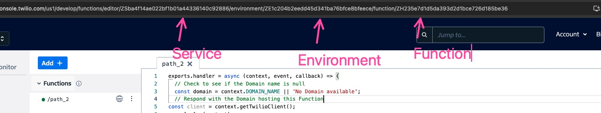

# Twilio Extract Function Logs

### Clone Repo

```
git clone https://github.com/pBread/twilio-extract-fn-logs.git
cd twilio-extract-fn-logs

cp .env.example .env
yarn

```

### Populate Environment Variables



### Start Downloading

```bash
yarn start
```
